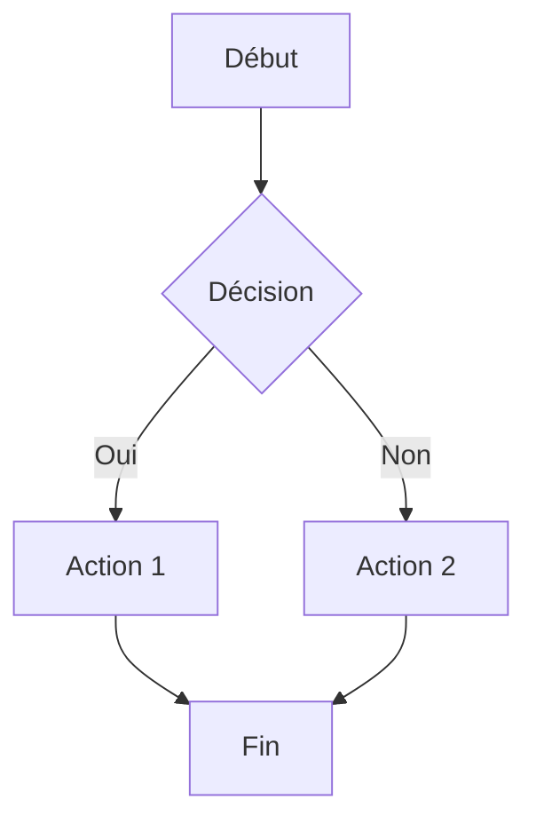
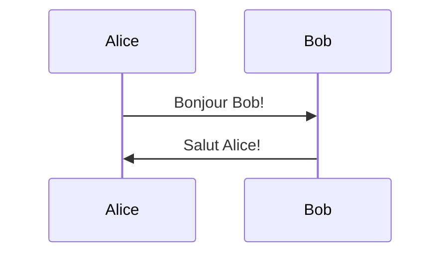

# Markdown to PDF Converter with Mermaid Support

Convertisseur Markdown → PDF avec support natif des diagrammes Mermaid, encapsulé dans Docker pour une utilisation simple.

## 🚀 Installation

```bash
# 1. Cloner ou télécharger ces fichiers
# - Dockerfile
# - md2pdf.sh

# 2. Rendre le script exécutable
chmod +x md2pdf.sh

# 3. C'est tout ! Le Docker image sera construit automatiquement au premier usage
```

## 📝 Utilisation

### Utilisation basique
```bash
./md2pdf.sh example.md
# Crée example.pdf dans le même dossier
```

### Spécifier le nom de sortie
```bash
./md2pdf.sh input.md output.pdf
```

### Options disponibles

Toutes les options sont optionnelles.

| Option | Description | Valeur par défaut |
|--------|-------------|-------------------|
| `-m, --margin SIZE` | Marges du document | `2.5cm` |
| `-f, --font FONT` | Police principale | `DejaVu Sans` |
| `--logo FILE` | Logo pour la page de titre | aucun |
| `--author AUTHOR` | Auteur du document | aucun |
| `--date DATE` | Date du document | date du jour |
| `-h, --help` | Affiche l'aide | - |

> [!NOTE]
> La page de titre n'est générée que si au moins une des options `--logo`, `--author` ou `--date` est spécifiée.

### Exemples

```bash
# Changer les marges
./md2pdf.sh document.md --margin 3cm

# Changer la police
./md2pdf.sh document.md --font "Arial"

# Avec page de titre complète
./md2pdf.sh document.md --logo logo.png --author "John Doe" --date "January 2026"

# Combiner les options
./md2pdf.sh document.md output.pdf --margin 2cm
```

## ✨ Fonctionnalités

### Table des matières automatique

Une table des matières numérotée est générée automatiquement à partir des titres du document (jusqu'à 3 niveaux de profondeur).

### Alertes GitHub

Support des alertes de style GitHub :

```markdown
> [!NOTE]
> Information utile pour l'utilisateur.

> [!TIP]
> Conseil pour optimiser l'utilisation.

> [!IMPORTANT]
> Information cruciale à ne pas manquer.

> [!WARNING]
> Attention, action potentiellement risquée.

> [!CAUTION]
> Danger, action irréversible.
```

### Diagrammes Mermaid

Les diagrammes Mermaid sont automatiquement convertis en images vectorielles (PDF) avec le thème "forest".

### Support des Emojis

Les emojis Unicode sont supportés dans le document.

## 📖 Exemple de fichier Markdown

```markdown
# Mon Document

## Introduction

Voici un diagramme de flux :



## Diagramme de séquence



## Notes importantes

> [!NOTE]
> Ceci est une note informative.

> [!WARNING]
> Attention à bien sauvegarder avant de continuer.

## Conclusion

Le texte continue normalement... 🎉
```

## ⚙️ Configuration avancée

### Modifier le Dockerfile

Si vous voulez personnaliser l'image (ajouter des polices, etc.) :

```dockerfile
# Ajouter des polices supplémentaires
RUN apt-get update && apt-get install -y \
    fonts-liberation \
    fonts-noto
```

Puis reconstruire :
```bash
docker build -t md2pdf .
```

## 🔧 Dépannage

### Docker n'est pas démarré
```
Error: Docker is not running
```
→ Lancez Docker Desktop

### Problème de permissions
```bash
# Sur Linux, vous pourriez avoir besoin de :
sudo usermod -aG docker $USER
# Puis redémarrer votre session
```

### Rebuild de l'image
```bash
docker rmi md2pdf
./md2pdf.sh document.md  # Reconstruira automatiquement
```

## 🎨 Types de diagrammes Mermaid supportés

- **Flowchart** : `graph TD`, `graph LR`
- **Sequence** : `sequenceDiagram`
- **Class** : `classDiagram`
- **State** : `stateDiagram-v2`
- **ER** : `erDiagram`
- **Gantt** : `gantt`
- **Pie** : `pie`
- **Git graph** : `gitGraph`

## 📦 Avantages de cette solution

✅ **Pas d'installation locale** - Tout est dans Docker  
✅ **Portable** - Fonctionne sur Mac, Linux, Windows  
✅ **Reproductible** - Même rendu partout  
✅ **Isolation** - N'interfère pas avec votre système  
✅ **Simple** - Un seul script à utiliser  

## 🆚 Comparaison avec installation locale

| Critère | Docker | Installation locale |
|---------|--------|---------------------|
| Installation | Simple (1 fichier) | Complexe (3+ outils) |
| Espace disque | ~500 MB | ~2-4 GB |
| Portabilité | Excellente | Dépend du système |
| Mise à jour | Rebuild image | Mise à jour manuelle |
| Performance | Légèrement plus lent | Plus rapide |

## 📄 Licence

Libre d'utilisation et de modification
