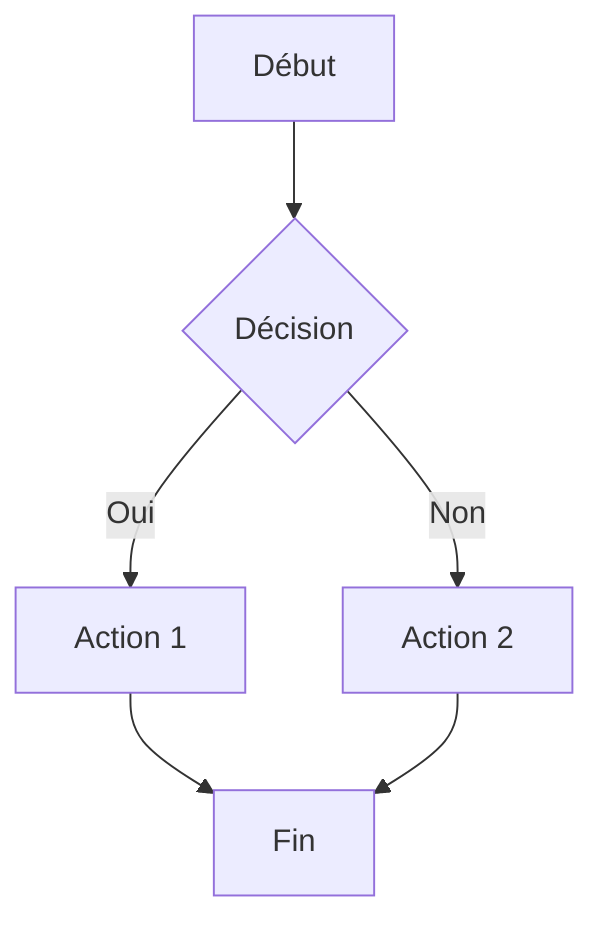
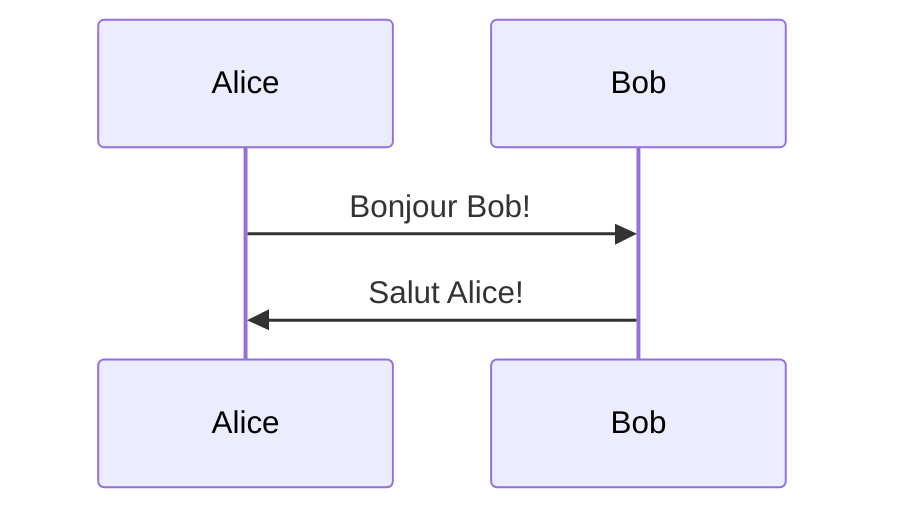

# Markdown to PDF Converter with Mermaid Support

Convertisseur Markdown → PDF avec support natif des diagrammes Mermaid, encapsulé dans Docker pour une utilisation simple.

## 🚀 Installation

```bash
# 1. Cloner ou télécharger ces fichiers
# - Dockerfile
# - md2pdf.sh

# 2. Rendre le script exécutable
chmod +x md2pdf.sh

# 3. C'est tout ! Le Docker image sera construit automatiquement au premier usage
```

## 📝 Utilisation

### Utilisation basique
```bash
./md2pdf.sh example.md
# Crée example.pdf dans le même dossier
```

### Spécifier le nom de sortie
```bash
./md2pdf.sh input.md output.pdf
```

### Avec options
```bash
# Changer les marges
./md2pdf.sh document.md --margin 3cm

# Changer la police
./md2pdf.sh document.md --font "Arial"

# Combiner les options
./md2pdf.sh document.md output.pdf --margin 2cm --font "Times New Roman"
```

## 📖 Exemple de fichier Markdown

```markdown
# Mon Document

## Introduction

Voici un diagramme de flux :



## Diagramme de séquence



## Conclusion

Le texte continue normalement...
```

## ⚙️ Configuration avancée

### Modifier le Dockerfile

Si vous voulez personnaliser l'image (ajouter des polices, etc.) :

```dockerfile
# Ajouter des polices supplémentaires
RUN apt-get update && apt-get install -y \
    fonts-liberation \
    fonts-noto
```

Puis reconstruire :
```bash
docker build -t md2pdf .
```

## 🔧 Dépannage

### Docker n'est pas démarré
```
Error: Docker is not running
```
→ Lancez Docker Desktop

### Problème de permissions
```bash
# Sur Linux, vous pourriez avoir besoin de :
sudo usermod -aG docker $USER
# Puis redémarrer votre session
```

### Rebuild de l'image
```bash
docker rmi md2pdf
./md2pdf.sh document.md  # Reconstruira automatiquement
```

## 🎨 Types de diagrammes Mermaid supportés

- **Flowchart** : `graph TD`, `graph LR`
- **Sequence** : `sequenceDiagram`
- **Class** : `classDiagram`
- **State** : `stateDiagram-v2`
- **ER** : `erDiagram`
- **Gantt** : `gantt`
- **Pie** : `pie`
- **Git graph** : `gitGraph`

## 📦 Avantages de cette solution

✅ **Pas d'installation locale** - Tout est dans Docker  
✅ **Portable** - Fonctionne sur Mac, Linux, Windows  
✅ **Reproductible** - Même rendu partout  
✅ **Isolation** - N'interfère pas avec votre système  
✅ **Simple** - Un seul script à utiliser  

## 🆚 Comparaison avec installation locale

| Critère | Docker | Installation locale |
|---------|--------|---------------------|
| Installation | Simple (1 fichier) | Complexe (3+ outils) |
| Espace disque | ~500 MB | ~2-4 GB |
| Portabilité | Excellente | Dépend du système |
| Mise à jour | Rebuild image | Mise à jour manuelle |
| Performance | Légèrement plus lent | Plus rapide |

## 📄 Licence

Libre d'utilisation et de modification
