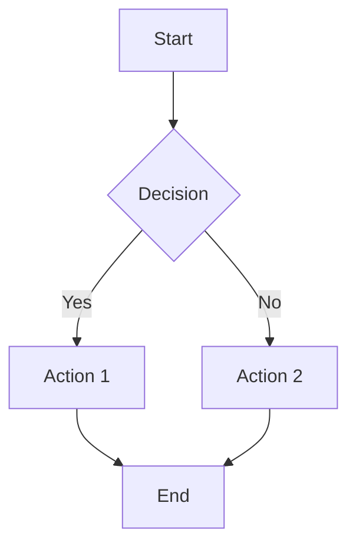
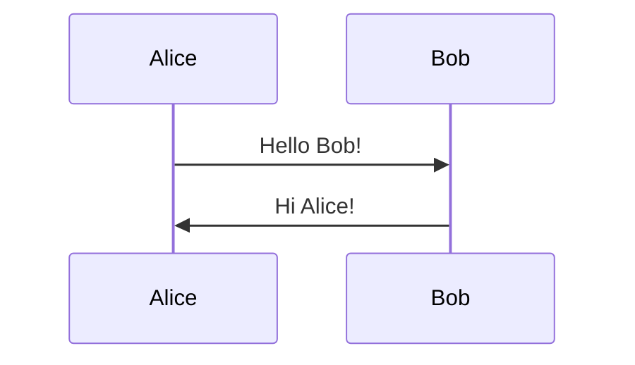

# Markdown to PDF Converter with Mermaid Support

Markdown → PDF converter with native Mermaid diagram support, packaged in a container (Docker or Podman) for simple usage.

## 🚀 Installation

### Via Homebrew (recommended)

```bash
brew tap pleymor/md2pdf
brew install md2pdf
```

### Via install script (curl)

For systems without Homebrew (Linux), a single command is enough (Docker or Podman required):

```bash
curl -fsSL https://raw.githubusercontent.com/pleymor/homebrew-md2pdf/main/install.sh | bash
```

The script installs the files into `~/.local/share/md2pdf` and creates a `md2pdf` symlink in `~/.local/bin`. To pin a version, use the `MD2PDF_VERSION` variable:

```bash
curl -fsSL https://raw.githubusercontent.com/pleymor/homebrew-md2pdf/main/install.sh | MD2PDF_VERSION=v1.2.0 bash
```

### Manual installation

```bash
# 1. Clone or download these files
# - Dockerfile
# - md2pdf.sh

# 2. Make the script executable
chmod +x md2pdf.sh

# 3. That's it! The Docker image will be built automatically on first use
```

## 📝 Usage

### Basic usage
```bash
./md2pdf.sh example.md
# Creates example.pdf in the same folder
```

### Specify the output name
```bash
./md2pdf.sh input.md output.pdf
```

### Available options

All options are optional.

| Option | Description | Default value |
|--------|-------------|-------------------|
| `-m, --margin SIZE` | Document margins | `2.5cm` |
| `-f, --font FONT` | Main font | `DejaVu Sans` |
| `--logo FILE` | Logo for the title page | none |
| `--author AUTHOR` | Document author | none |
| `--date DATE` | Document date | today's date |
| `-h, --help` | Show help | - |

> [!NOTE]
> The title page is only generated if at least one of the `--logo`, `--author` or `--date` options is specified.

### Examples

```bash
# Change the margins
./md2pdf.sh document.md --margin 3cm

# Change the font
./md2pdf.sh document.md --font "Arial"

# With a full title page
./md2pdf.sh document.md --logo logo.png --author "John Doe" --date "January 2026"

# Combine options
./md2pdf.sh document.md output.pdf --margin 2cm
```

## ✨ Features

### Automatic table of contents

A numbered table of contents is generated automatically from the document headings (up to 3 levels deep).

### GitHub alerts

Support for GitHub-style alerts:

```markdown
> [!NOTE]
> Useful information for the user.

> [!TIP]
> Tip to optimize usage.

> [!IMPORTANT]
> Crucial information not to be missed.

> [!WARNING]
> Caution, potentially risky action.

> [!CAUTION]
> Danger, irreversible action.
```

### Mermaid diagrams

Mermaid diagrams are automatically converted to vector images (PDF) with the "forest" theme.

### Emoji support

Unicode emojis are supported in the document.

## 📖 Example Markdown file

```markdown
# My Document

## Introduction

Here is a flowchart:


```mermaid
graph TD
    A[Start] --> B{Decision}
    B -->|Yes| C[Action 1]
    B -->|No| D[Action 2]
    C --> E[End]
    D --> E
```

## Sequence diagram


```mermaid
sequenceDiagram
    participant A as Alice
    participant B as Bob
    A->>B: Hello Bob!
    B->>A: Hi Alice!
```

## Important notes

> [!NOTE]
> This is an informative note.

> [!WARNING]
> Make sure to save before continuing.

## Conclusion

The text continues normally... 🎉
```

## ⚙️ Advanced configuration

### Modifying the Dockerfile

If you want to customize the image (add fonts, etc.):

```dockerfile
# Add additional fonts
RUN apt-get update && apt-get install -y \
    fonts-liberation \
    fonts-noto
```

Then rebuild:
```bash
docker build -t md2pdf .
```

## 🐳 Docker or Podman

md2pdf works with **Docker** or **Podman**. The engine is detected
automatically (Docker first, then Podman). To force a specific engine,
set the `MD2PDF_CONTAINER_ENGINE` environment variable:

```bash
MD2PDF_CONTAINER_ENGINE=podman ./md2pdf.sh document.md
```

## 🔧 Troubleshooting

### No container engine available
```
Error: No working container engine found.
```
→ Install and start Docker (Docker Desktop) or Podman, or set
`MD2PDF_CONTAINER_ENGINE`.

### Permission issue
```bash
# On Linux, you may need to:
sudo usermod -aG docker $USER
# Then restart your session
```

### Rebuild the image
```bash
docker rmi md2pdf   # or: podman rmi md2pdf
./md2pdf.sh document.md  # Will rebuild automatically
```

## 🎨 Supported Mermaid diagram types

- **Flowchart**: `graph TD`, `graph LR`
- **Sequence**: `sequenceDiagram`
- **Class**: `classDiagram`
- **State**: `stateDiagram-v2`
- **ER**: `erDiagram`
- **Gantt**: `gantt`
- **Pie**: `pie`
- **Git graph**: `gitGraph`

## 📦 Advantages of this solution

✅ **No local installation** - Everything is in Docker  
✅ **Portable** - Works on Mac, Linux, Windows  
✅ **Reproducible** - Same output everywhere  
✅ **Isolation** - Doesn't interfere with your system  
✅ **Simple** - A single script to use  

## 🆚 Comparison with local installation

| Criterion | Docker | Local installation |
|---------|--------|---------------------|
| Installation | Simple (1 file) | Complex (3+ tools) |
| Disk space | ~500 MB | ~2-4 GB |
| Portability | Excellent | Depends on the system |
| Update | Rebuild image | Manual update |
| Performance | Slightly slower | Faster |

## 🍺 Publishing a new version (contributors)

Releases are automated by the **Release** workflow (`.github/workflows/release.yml`).

1. From the GitHub **Actions** tab, run the **Release** workflow (`Run workflow`).
2. Enter the target version, e.g. `1.3.0` (a leading `v` is tolerated). Tick `dry_run`
   to validate and inspect the diff without publishing anything.

The workflow creates and pushes the tag, computes the archive `sha256`, updates
`Formula/md2pdf.rb` / `install.sh` / `README.md`, commits the bump to `main`, and creates
the GitHub Release with auto-generated notes.

To test the formula locally:

```bash
brew install --build-from-source Formula/md2pdf.rb
```

## 📄 License

Free to use and modify
