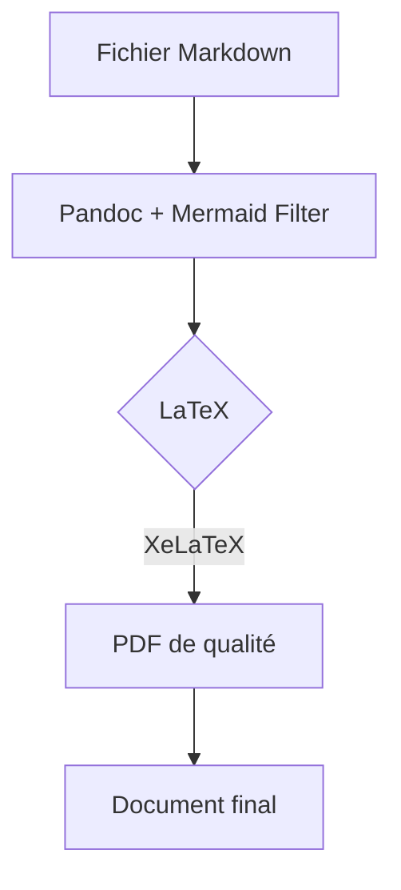
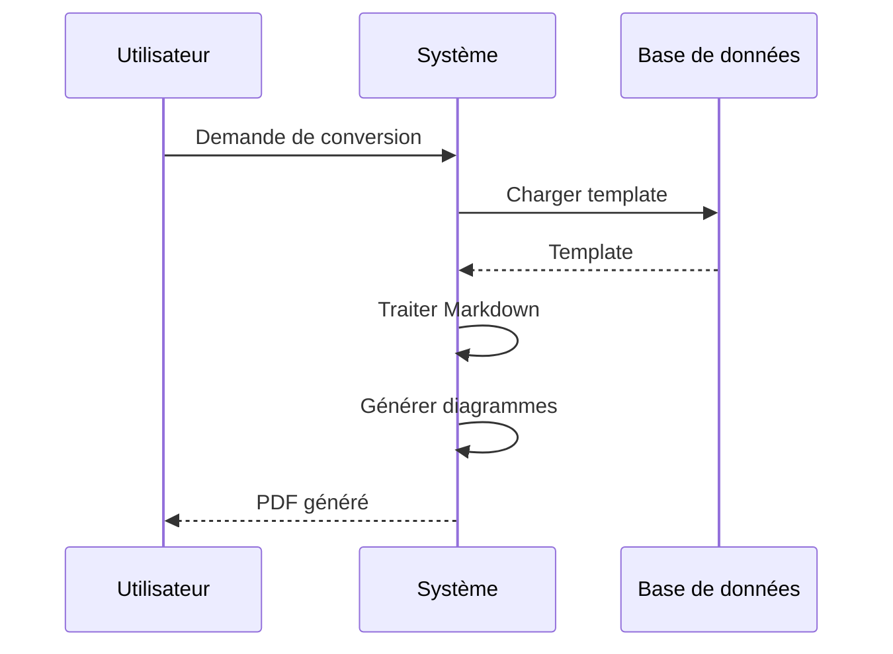
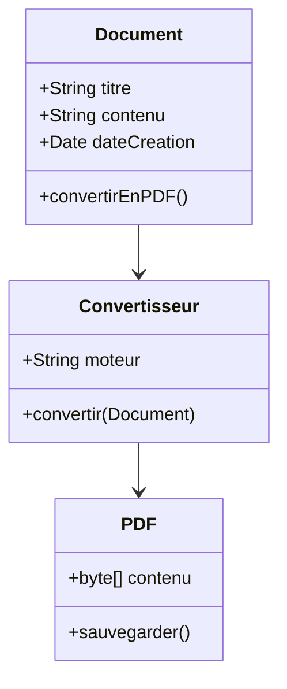
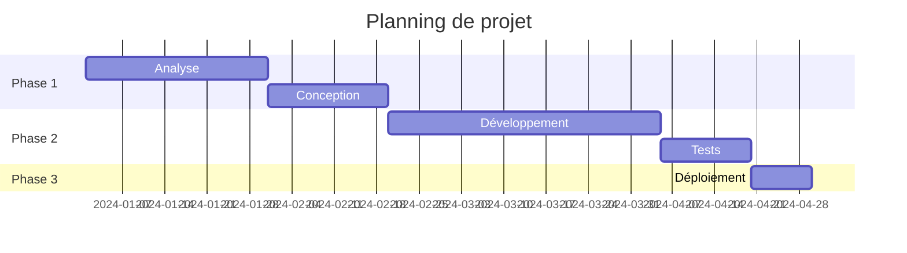
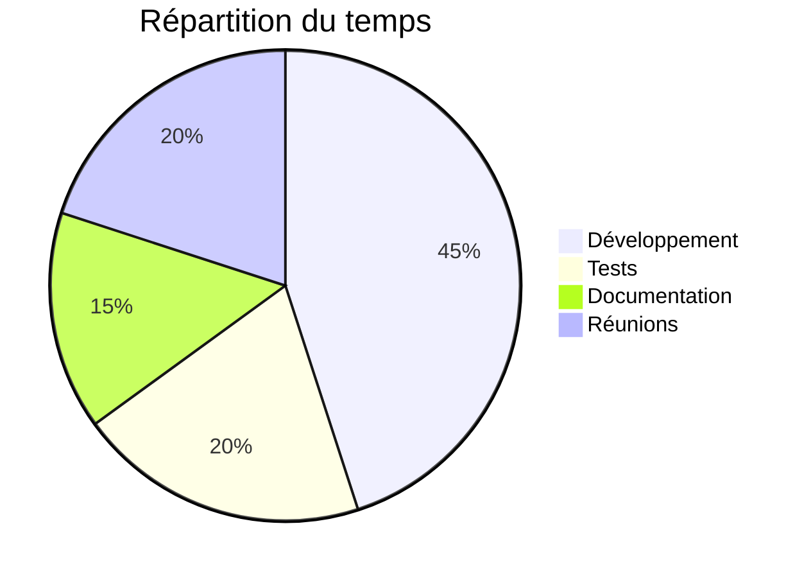

# Exemple de Document Markdown

## Introduction

Ce document démontre la conversion Markdown → PDF avec support des diagrammes Mermaid.

---

## Diagramme de flux

Voici un exemple de diagramme de flux simple :



## Diagramme de séquence

Un exemple d'interaction entre utilisateur et système :



## Diagramme de classes

Structure d'un système simple :



## Fonctionnalités du texte

### Formatage de base

- **Gras** et *italique*
- ~~Barré~~
- `Code inline`
- [Liens](https://example.com)

### Listes

1. Premier élément
2. Deuxième élément
   - Sous-élément A
   - Sous-élément B
3. Troisième élément

### Code

```python
def convertir_markdown(fichier):
    """Convertit un fichier Markdown en PDF"""
    with open(fichier, 'r') as f:
        contenu = f.read()
    return generer_pdf(contenu)
```

### Citations

> La simplicité est la sophistication suprême.
> — Léonard de Vinci

### Tableau

| Outil | Avantage | Inconvénient |
|-------|----------|--------------|
| Pandoc | Flexible | Configuration |
| Typora | Simple | Payant |
| Docker | Portable | Espace disque |

## Diagramme Gantt

Planning d'un projet :



## Diagramme circulaire

Répartition du temps :



## Conclusion

Ce document démontre les capacités de conversion avec :

- ✅ Diagrammes Mermaid variés
- ✅ Formatage Markdown complet
- ✅ Tableaux et listes
- ✅ Code et citations
- ✅ Support Unicode (français, émojis)

Le rendu PDF devrait être propre et professionnel ! 🎉

## Informations, Warnings et Erreurs

> [!NOTE]  
> Highlights information that users should take into account, even when skimming.

> [!TIP]
> Optional information to help a user be more successful.

> [!IMPORTANT]  
> Crucial information necessary for users to succeed.

> [!WARNING]  
> Critical content demanding immediate user attention due to potential risks.

> [!CAUTION]
> Negative potential consequences of an action.

