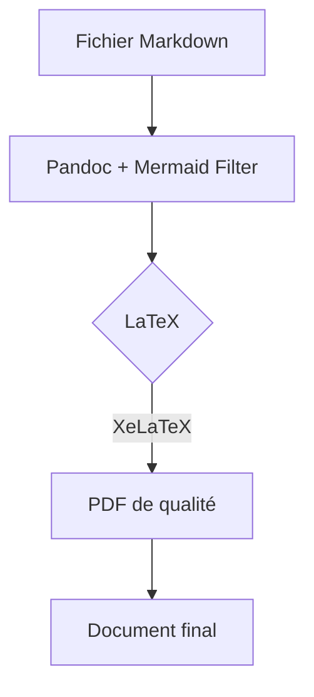
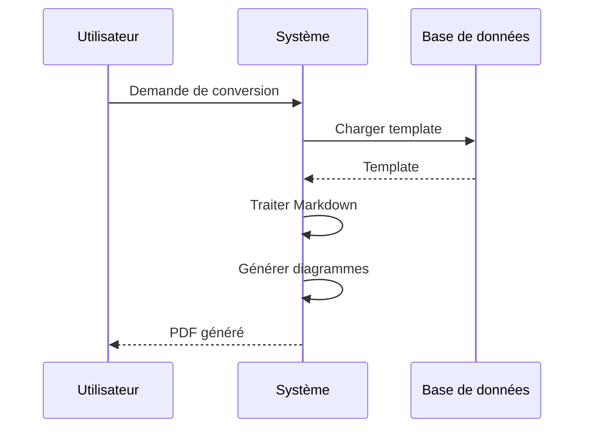
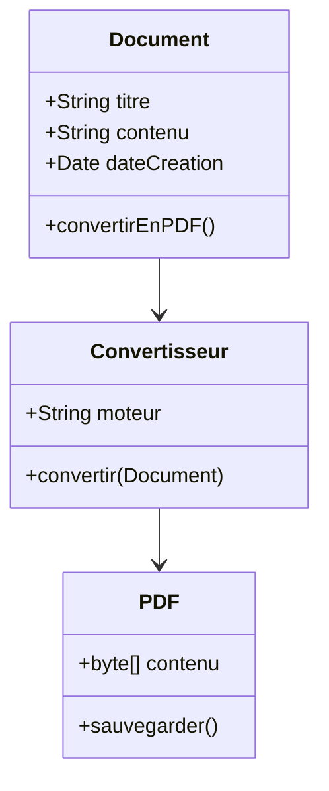
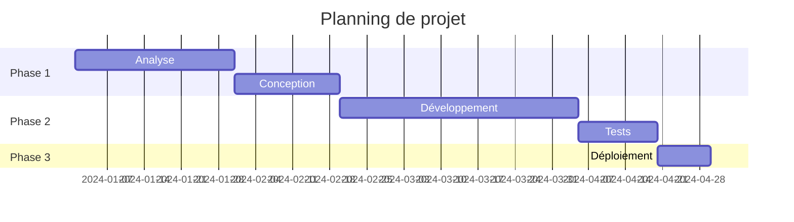
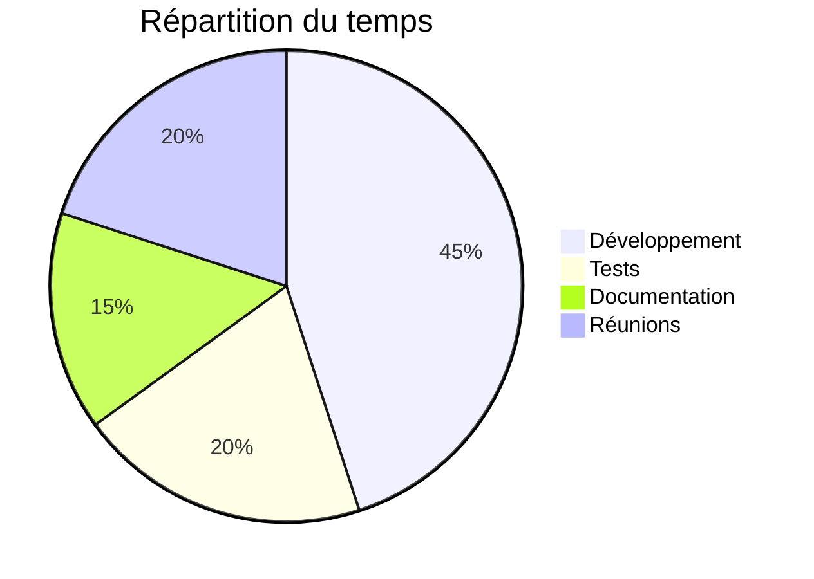

# Exemple de Document Markdown

## Introduction

Ce document démontre la conversion Markdown → PDF avec support des diagrammes Mermaid.

---

## Diagramme de flux

Voici un exemple de diagramme de flux simple :


```mermaid
graph TD
    A[Fichier Markdown] --> B[Pandoc + Mermaid Filter]
    B --> C{LaTeX}
    C -->|XeLaTeX| D[PDF de qualité]
    D --> E[Document final]
```

## Diagramme de séquence

Un exemple d'interaction entre utilisateur et système :


```mermaid
sequenceDiagram
    participant U as Utilisateur
    participant S as Système
    participant D as Base de données
    
    U->>S: Demande de conversion
    S->>D: Charger template
    D-->>S: Template
    S->>S: Traiter Markdown
    S->>S: Générer diagrammes
    S-->>U: PDF généré
```

## Diagramme de classes

Structure d'un système simple :


```mermaid
classDiagram
    class Document {
        +String titre
        +String contenu
        +Date dateCreation
        +convertirEnPDF()
    }
    
    class Convertisseur {
        +String moteur
        +convertir(Document)
    }
    
    class PDF {
        +byte[] contenu
        +sauvegarder()
    }
    
    Document --> Convertisseur
    Convertisseur --> PDF
```

## Fonctionnalités du texte

### Formatage de base

- **Gras** et *italique*
- ~~Barré~~
- `Code inline`
- [Liens](https://example.com)

### Listes

1. Premier élément
2. Deuxième élément
   - Sous-élément A
   - Sous-élément B
3. Troisième élément

### Code

```python
def convertir_markdown(fichier):
    """Convertit un fichier Markdown en PDF"""
    with open(fichier, 'r') as f:
        contenu = f.read()
    return generer_pdf(contenu)
```

### Citations

> La simplicité est la sophistication suprême.
> — Léonard de Vinci

### Tableau simple

| Outil | Avantage | Inconvénient |
|-------|----------|--------------|
| Pandoc | Flexible | Configuration |
| Typora | Simple | Payant |
| Docker | Portable | Espace disque |

### Tableau avec colonnes hétérogènes

| ID | Nom | Description | Statut |
|----|-----|-------------|--------|
| 1 | Pandoc | Convertisseur universel de documents supportant des dizaines de formats d'entrée et de sortie | Actif |
| 2 | XeLaTeX | Moteur LaTeX avec support natif Unicode et polices système OpenType/TrueType | Actif |
| 3 | Mermaid | Outil de génération de diagrammes à partir de texte, intégré dans de nombreuses plateformes | Beta |

### Tableau avec beaucoup de colonnes

| Langue | Typage | Paradigme | Perf. | Écosystème | Courbe |
|--------|--------|-----------|-------|------------|--------|
| Python | Dynamique | Multi | Moyenne | Très riche | Douce |
| Rust | Statique | Système | Haute | Croissant | Raide |
| Go | Statique | Concurrent | Haute | Solide | Douce |
| JS | Dynamique | Event-driven | Moyenne | Immense | Moyenne |

### Tableau avec contenu non homogène

| Composant | Entrée | Traitement | Sortie |
|-----------|--------|------------|--------|
| Parser Markdown | Fichier `.md` brut avec métadonnées YAML, liens, images et blocs de code imbriqués | Analyse syntaxique | AST |
| Mermaid Filter | AST | Détection des blocs mermaid, lancement de Chromium headless pour le rendu SVG/PDF de chaque diagramme, puis réinjection dans le document | Diagrammes rendus |
| Moteur LaTeX | AST enrichi | Compilation | PDF |
| Post-traitement | PDF brut | Vérification des liens internes, numérotation des pages, génération de la table des matières et ajout des métadonnées XMP au fichier final | PDF finalisé |

## Diagramme Gantt

Planning d'un projet :


```mermaid
gantt
    title Planning de projet
    dateFormat YYYY-MM-DD
    section Phase 1
    Analyse       :a1, 2024-01-01, 30d
    Conception    :a2, after a1, 20d
    section Phase 2
    Développement :a3, after a2, 45d
    Tests         :a4, after a3, 15d
    section Phase 3
    Déploiement   :after a4, 10d
```

## Diagramme circulaire

Répartition du temps :


```mermaid
pie title Répartition du temps
    "Développement" : 45
    "Tests" : 20
    "Documentation" : 15
    "Réunions" : 20
```

## Conclusion

Ce document démontre les capacités de conversion avec :

- ✅ Diagrammes Mermaid variés
- ✅ Formatage Markdown complet
- ✅ Tableaux et listes
- ✅ Code et citations
- ✅ Support Unicode (français, émojis)

Le rendu PDF devrait être propre et professionnel ! 🎉

## Informations, Warnings et Erreurs

> [!NOTE]  
> Highlights information that users should take into account, even when skimming.

> [!TIP]
> Optional information to help a user be more successful.

> [!IMPORTANT]  
> Crucial information necessary for users to succeed.

> [!WARNING]  
> Critical content demanding immediate user attention due to potential risks.

> [!CAUTION]
> Negative potential consequences of an action.

