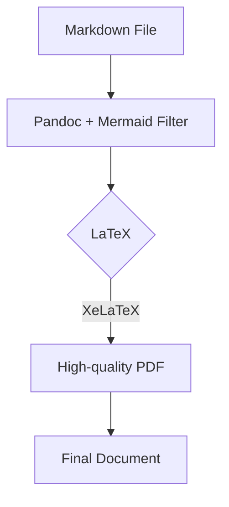
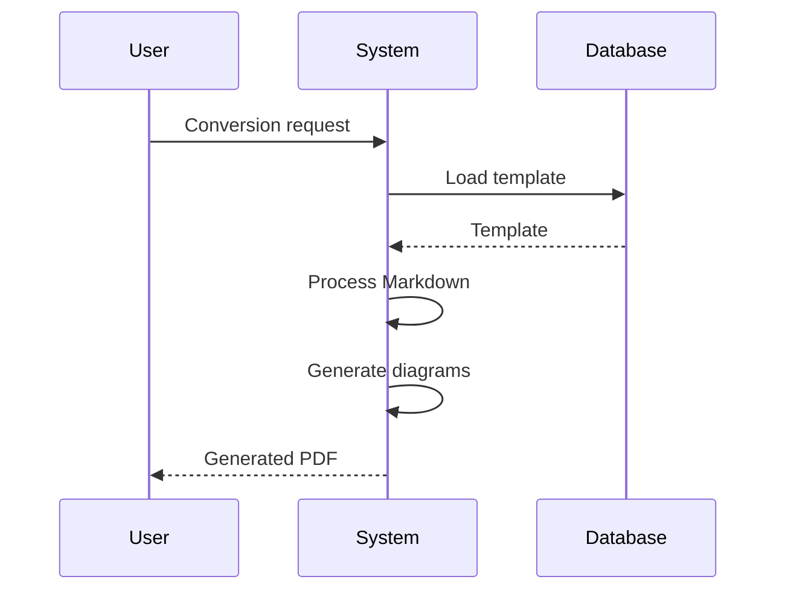
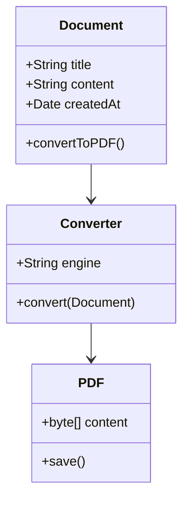
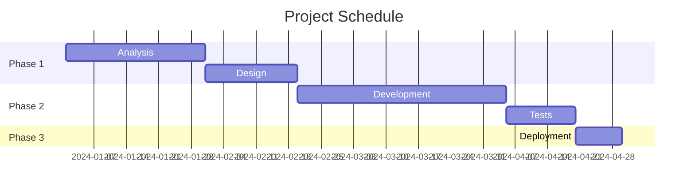
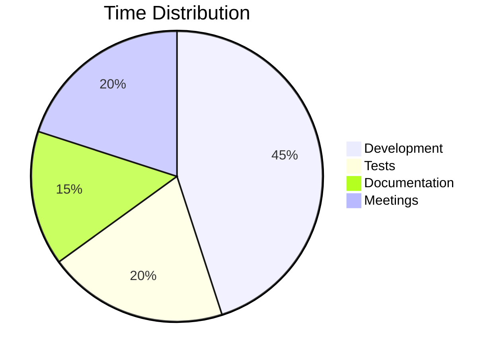

# Example Markdown Document

## Introduction

This document demonstrates Markdown → PDF conversion with Mermaid diagram support.

Paragraph 1: lorem ipsum dolor sit amet, consectetur adipiscing elit. Sed do eiusmod tempor incididunt ut labore et dolore magna aliqua. Ut enim ad minim veniam, quis nostrud exercitation ullamco laboris nisi ut aliquip ex ea commodo consequat.

Paragraph 2: Duis aute irure dolor in reprehenderit in voluptate velit esse cillum dolore eu fugiat nulla pariatur. Excepteur sint occaecat cupidatat non proident, sunt in culpa qui officia deserunt mollit anim id est laborum.

---

## Flowchart

Here is a simple flowchart example:


```mermaid
graph TD
    A[Markdown File] --> B[Pandoc + Mermaid Filter]
    B --> C{LaTeX}
    C -->|XeLaTeX| D[High-quality PDF]
    D --> E[Final Document]
```

## Sequence Diagram

An example of interaction between user and system:


```mermaid
sequenceDiagram
    participant U as User
    participant S as System
    participant D as Database
    
    U->>S: Conversion request
    S->>D: Load template
    D-->>S: Template
    S->>S: Process Markdown
    S->>S: Generate diagrams
    S-->>U: Generated PDF
```

## Class Diagram

Structure of a simple system:


```mermaid
classDiagram
    class Document {
        +String title
        +String content
        +Date createdAt
        +convertToPDF()
    }
    
    class Converter {
        +String engine
        +convert(Document)
    }
    
    class PDF {
        +byte[] content
        +save()
    }
    
    Document --> Converter
    Converter --> PDF
```

## Text Features

### Basic Formatting

- **Bold** and *italic*
- ~~Strikethrough~~
- `Inline code`
- [Links](https://example.com)

### Lists

1. First item
2. Second item
   - Sub-item A
   - Sub-item B
3. Third item

### Code

```python
def convert_markdown(file):
    """Convert a Markdown file to PDF"""
    with open(file, 'r') as f:
        content = f.read()
    return generate_pdf(content)
```

### Quotes

> Simplicity is the ultimate sophistication.
> — Leonardo da Vinci

### Simple Table

| Tool | Advantage | Drawback |
|-------|----------|--------------|
| Pandoc | Flexible | Configuration |
| Typora | Simple | Paid |
| Docker | Portable | Disk space |

### Table with Heterogeneous Columns

| ID | Name | Description | Status |
|----|-----|-------------|--------|
| 1 | Pandoc | Universal document converter supporting dozens of input and output formats | Active |
| 2 | XeLaTeX | LaTeX engine with native Unicode support and OpenType/TrueType system fonts | Active |
| 3 | Mermaid | Tool for generating diagrams from text, integrated into many platforms | Beta |

### Table with Many Columns

| Language | Typing | Paradigm | Perf. | Ecosystem | Curve |
|--------|--------|-----------|-------|------------|--------|
| Python | Dynamic | Multi | Medium | Very rich | Gentle |
| Rust | Static | Systems | High | Growing | Steep |
| Go | Static | Concurrent | High | Solid | Gentle |
| JS | Dynamic | Event-driven | Medium | Huge | Medium |

### Table with Non-uniform Content

| Component | Input | Processing | Output |
|-----------|--------|------------|--------|
| Markdown Parser | Raw `.md` file with YAML metadata, links, images and nested code blocks | Syntax analysis | AST |
| Mermaid Filter | AST | Detection of mermaid blocks, launching headless Chromium to render each diagram as SVG/PDF, then reinjecting into the document | Rendered diagrams |
| LaTeX Engine | Enriched AST | Compilation | PDF |
| Post-processing | Raw PDF | Verifying internal links, page numbering, generating the table of contents and adding XMP metadata to the final file | Finalized PDF |

## Gantt Diagram

Project schedule:


```mermaid
gantt
    title Project Schedule
    dateFormat YYYY-MM-DD
    section Phase 1
    Analysis      :a1, 2024-01-01, 30d
    Design        :a2, after a1, 20d
    section Phase 2
    Development   :a3, after a2, 45d
    Tests         :a4, after a3, 15d
    section Phase 3
    Deployment    :after a4, 10d
```

## Pie Chart

Time distribution:


```mermaid
pie title Time Distribution
    "Development" : 45
    "Tests" : 20
    "Documentation" : 15
    "Meetings" : 20
```

## Checklist

- [ ] Item 1
- [ ] Item 2
- [ ] Item 3

## Conclusion

This document demonstrates conversion capabilities with:

- ✅ Various Mermaid diagrams
- ✅ Complete Markdown formatting
- ✅ Tables and lists
- ✅ Code and quotes
- ✅ Unicode support (accents, emojis)

The PDF output should be **clean** and **professional**! 🎉

## Notes, Warnings and Errors

> [!NOTE]  
> Highlights information that users should take into account, even when skimming.
> It supports **formatting** and multiline content.

> [!TIP]
> Optional information to help a user be more successful.

> [!IMPORTANT]  
> Crucial information necessary for users to succeed.

> [!WARNING]  
> Critical content demanding immediate user attention due to potential risks.

> [!CAUTION]
> Negative potential consequences of an action.
