# Exemple de Document Markdown

## Introduction

Ce document démontre la conversion Markdown → PDF avec support des diagrammes Mermaid.

---

## Diagramme de flux

Voici un exemple de diagramme de flux simple :

```mermaid
graph TD
    A[Fichier Markdown] --> B[Pandoc + Mermaid Filter]
    B --> C{LaTeX}
    C -->|XeLaTeX| D[PDF de qualité]
    D --> E[Document final]
```



## Diagramme de séquence

Un exemple d'interaction entre utilisateur et système :

```mermaid
sequenceDiagram
    participant U as Utilisateur
    participant S as Système
    participant D as Base de données
    
    U->>S: Demande de conversion
    S->>D: Charger template
    D-->>S: Template
    S->>S: Traiter Markdown
    S->>S: Générer diagrammes
    S-->>U: PDF généré
```



## Diagramme de classes

Structure d'un système simple :


## Fonctionnalités du texte

### Formatage de base

- **Gras** et *italique*
- ~~Barré~~
- `Code inline`
- [Liens](https://example.com)

### Listes

1. Premier élément
2. Deuxième élément
   - Sous-élément A
   - Sous-élément B
3. Troisième élément

### Code

```python
def convertir_markdown(fichier):
    """Convertit un fichier Markdown en PDF"""
    with open(fichier, 'r') as f:
        contenu = f.read()
    return generer_pdf(contenu)
```

### Citations

> La simplicité est la sophistication suprême.
> — Léonard de Vinci

### Tableau

| Outil | Avantage | Inconvénient |
|-------|----------|--------------|
| Pandoc | Flexible | Configuration |
| Typora | Simple | Payant |
| Docker | Portable | Espace disque |

## Diagramme Gantt

Planning d'un projet :

```mermaid
gantt
    title Planning de projet
    dateFormat YYYY-MM-DD
    section Phase 1
    Analyse       :a1, 2024-01-01, 30d
    Conception    :a2, after a1, 20d
    section Phase 2
    Développement :a3, after a2, 45d
    Tests         :a4, after a3, 15d
    section Phase 3
    Déploiement   :after a4, 10d
```



## Diagramme circulaire

Répartition du temps :

```mermaid
pie title Répartition du temps
    "Développement" : 45
    "Tests" : 20
    "Documentation" : 15
    "Réunions" : 20
```



## Conclusion

Ce document démontre les capacités de conversion avec :

- ✅ Diagrammes Mermaid variés
- ✅ Formatage Markdown complet
- ✅ Tableaux et listes
- ✅ Code et citations
- ✅ Support Unicode (français, émojis)

Le rendu PDF devrait être propre et professionnel ! 🎉

## Informations, Warnings et Erreurs

> [!NOTE]  
> Highlights information that users should take into account, even when skimming.

> [!TIP]
> Optional information to help a user be more successful.

> [!IMPORTANT]  
> Crucial information necessary for users to succeed.

> [!WARNING]  
> Critical content demanding immediate user attention due to potential risks.

> [!CAUTION]
> Negative potential consequences of an action.

